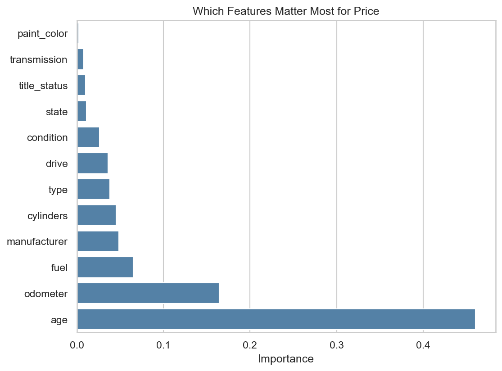

# Car-prices-analysis
# What Drives the Price of a Used Car?

**Jupyter notebook:** [prompt_II_solution.ipynb](prompt_II_solution.ipynb)

## Business Problem

A used car dealership wants to fine-tune its inventory. To do that, it needs to understand which characteristics make a used car more or less valuable to buyers. This project uses about 426,000 used car listings to identify the main drivers of price and to give the dealership clear, practical recommendations.

I framed this as a **regression problem**: predict a car's price from its characteristics (age, mileage, brand, condition, fuel type, and so on), then interpret the model to see which features push price up or down. Because the client cares about *why* prices differ, I favored models whose results we could explain.

## Data

The dataset is a 426,000-row subset of a Kaggle dataset of used car listings. After cleaning, about 238,000 listings remained. The main cleaning steps were:

- Removed about 130,000 **duplicate listings** (the same car posted in several regions)
- Kept prices between **\$1,000 and \$100,000** (removing placeholder prices and rare cars)
- Kept model years **1990 to 2021** and odometer readings between **1 and 200,000 miles**
- Filled missing categorical values with "unknown" instead of dropping rows
- Created an **age** feature and modeled the **log of price** to handle skew and the curved depreciation pattern

## Approach

I followed the **CRISP-DM** process: Business Understanding, Data Understanding, Data Preparation, Modeling, and Evaluation.

I compared five models using 5-fold cross-validation and grid search:

| Model | Validation RMSE (log price) |
|---|---|
| Baseline (always predict the average) | 0.833 |
| Linear Regression | 0.424 |
| Ridge (grid search over alpha) | 0.424 |
| Lasso (grid search over alpha) | 0.424 |
| Polynomial features + Ridge | **0.410** |

**Evaluation metric:** I used RMSE on log price to select models, because it measures error in relative (percent) terms, which is fair to both cheap and expensive cars. For the dealership, I also report the error in dollars.

**Final performance on test data:** the best model is typically within **about 20% of a car's listing price**, with an average error of about **\$4,600**, compared with about **\$10,700** for the baseline. It is most accurate for cars priced between \$5,000 and \$35,000.

## Key Findings

1. **Age and mileage matter most.** Holding everything else equal, a car loses about **6.6% of its value per year of age** and about **4.3% per 10,000 miles**.
2. **Trucks, diesel engines, and larger engines hold a premium.** Pickups and trucks, diesel vehicles, cars with 8 or more cylinders, and 4WD vehicles sell for more than comparable cars.
3. **Brand matters, especially at the luxury end.** Porsche and Lexus sell for significantly more than comparable mainstream brands, while discontinued brands like Mercury and Saturn sell for less.
4. **Title problems and poor condition sharply reduce value.** Salvage, rebuilt, missing, or parts-only titles and fair or salvage condition lead to much lower prices.
5. **Paint color barely matters.**



## Recommendations for the Dealership

- **Prioritize newer, lower-mileage vehicles.** They are the most reliable inventory to buy and price.
- **Stock trucks, pickups, and 4WD vehicles,** which hold their value better than sedans and hatchbacks.
- **Look for diesel and larger-engine vehicles,** which carry a clear price premium.
- **Be cautious with salvage, rebuilt, or missing-title vehicles.** Only acquire them at a big discount.
- **Don't pay extra for paint color.**
- **Use the price model as a starting point, not a final price,** especially for budget and luxury cars.

## Limitations

- Prices are **asking prices** from listings, not final sale prices.
- Condition is **self-reported** by sellers.
- The data lacks **trim level, accident history, and options**, which limits accuracy.
- Findings apply to cars priced \$1,000 to \$100,000, model years 1990 to 2021, with up to 200,000 miles.

## Next Steps

- Add richer data such as trim level and accident history (for example, from VIN reports).
- Use the dealership's own **actual sale prices**.
- Refresh the analysis regularly as the used car market changes.

## Repository Structure

```
├── README.md            Summary of findings (this file)
├── prompt_II.ipynb      Full analysis notebook
├── data/
│   └── vehicles.csv     Used car listings dataset
└── images/              Saved plots (optional)
```

## Tools

Python, pandas, NumPy, matplotlib, seaborn, scikit-learn

